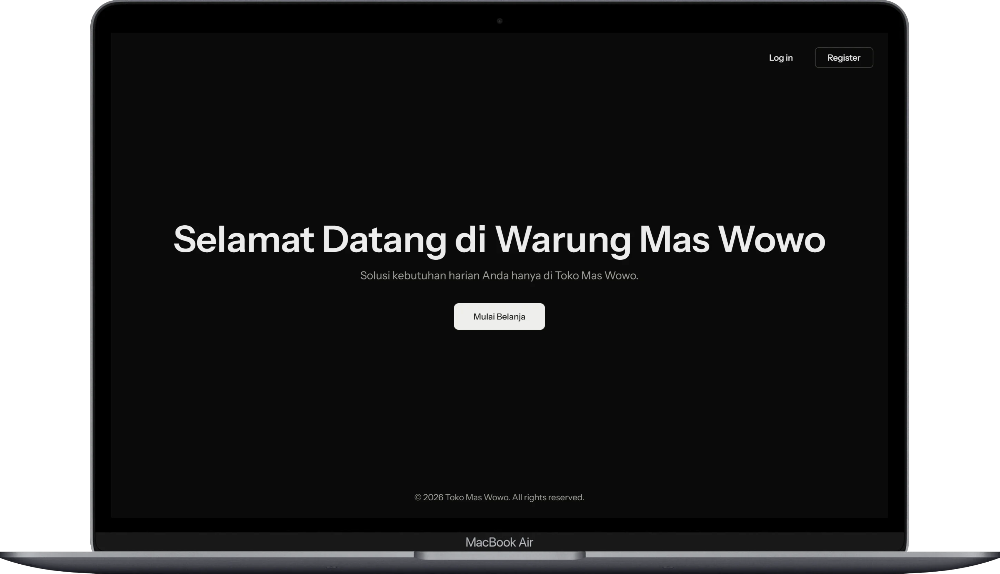
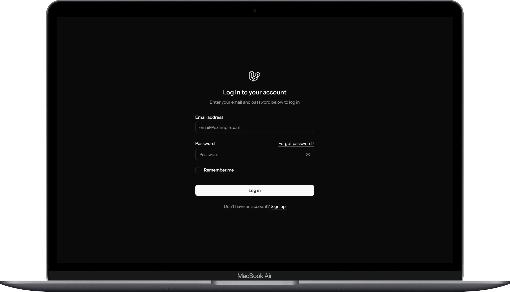

# Praktikum Pertemuan 05 - Sistem Inventaris Toko

Project ini adalah sistem inventaris toko untuk Pak Cokomi dan Mas Wowo yang dikembangkan menggunakan Laravel, Inertia.js, dan React.

## Fitur Utama
* **CRUD Produk**: Kelola data produk (Tambah, Lihat, Edit, Hapus).
* **Authentication**: Login & Register sistem menggunakan Laravel Breeze.
* **Seeder & Factory**: Data produk dummy otomatis untuk kemudahan testing.
* **UI Komponen**:
    * Data Table untuk list produk.
    * Form Create & Edit.
    * Modal konfirmasi hapus.

## Cara Instalasi
1. Clone repository.
2. `composer install`.
3. `npm install`.
4. Copy `.env.example` ke `.env` dan konfigurasi database.
5. `php artisan key:generate`.
6. `php artisan migrate --seed`.
7. `npm run dev` & `php artisan serve`.

## Screenshots

