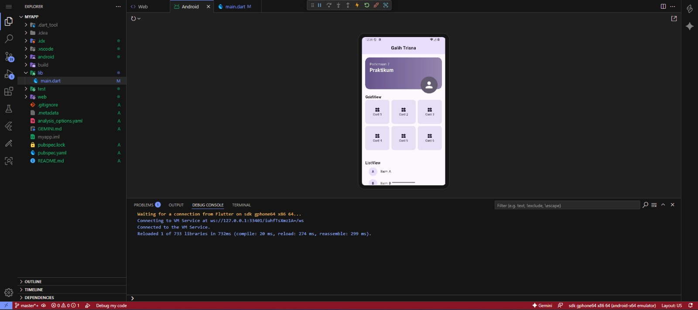
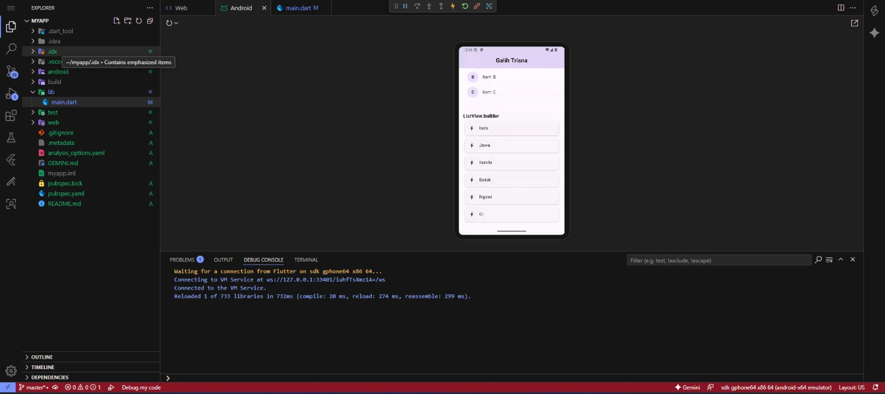
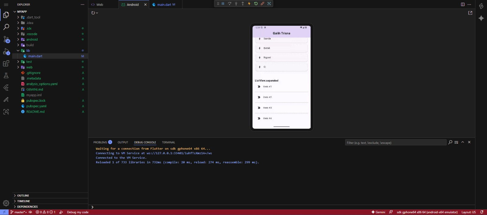

# Tugas Praktikum Modul Flutter - Pertemuan 07

## Nama: Galih Trisna
## NIM: 2311102050

Project Flutter ini dibuat untuk memenuhi tugas praktikum yang mendemonstrasikan penggunaan berbagai widget UI dasar dalam Flutter.

### Widget yang Diimplementasikan:
1.  **Container**
2.  **GridView**
3.  **ListView**
4.  **ListView.builder**
5.  **ListView.separated**
6.  **Stack**

---

## Penjelasan Widget

### 1. Container
`Container` adalah widget dekoratif dan layouting yang sangat fleksibel. Widget ini dapat digunakan untuk mengatur padding, margin, warna latar belakang, border, hingga gradien.
*   **Penggunaan dalam kode:** Digunakan sebagai background header dengan gradien warna serta sebagai kotak item di dalam `GridView`.

### 2. GridView
`GridView` digunakan untuk menyusun widget dalam format baris dan kolom (grid). Widget ini sangat berguna untuk menampilkan koleksi data dalam bentuk galeri atau dashboard.
*   **Penggunaan dalam kode:** Menggunakan `GridView.count` untuk menampilkan 6 buah kartu (item) dengan layout 3 kolom.

### 3. ListView
`ListView` adalah widget yang menyusun elemen secara linier (biasanya vertikal). Cocok digunakan untuk list yang jumlah itemnya sedikit dan statis.
*   **Penggunaan dalam kode:** Digunakan untuk menampilkan tiga item statis (Item A, Item B, dan Item C) menggunakan widget `ListTile`.

### 4. ListView.builder
`ListView.builder` merupakan cara yang efisien untuk membuat list dengan jumlah item yang banyak atau dinamis. Widget ini hanya akan merender item yang terlihat di layar (lazy loading).
*   **Penggunaan dalam kode:** Digunakan untuk merender list dari data array `dynamicItems` (Indo, Jawa, Sunda, dll).

### 5. ListView.separated
Varian dari `ListView.builder` yang memungkinkan penambahan widget "pemisah" (separator) di antara setiap item dalam list.
*   **Penggunaan dalam kode:** Digunakan untuk membuat list dengan garis pembatas (`Divider`) di antara setiap itemnya.

### 6. Stack
`Stack` memungkinkan kita untuk menumpuk satu widget di atas widget lainnya. Widget pertama dalam stack akan berada di paling bawah, dan widget berikutnya akan menumpuk di atasnya.
*   **Penggunaan dalam kode:** Digunakan pada bagian header untuk menumpuk `CircleAvatar` (ikon profil) di atas sebuah `Container` berwarna.

---

## Screenshot Hasil

